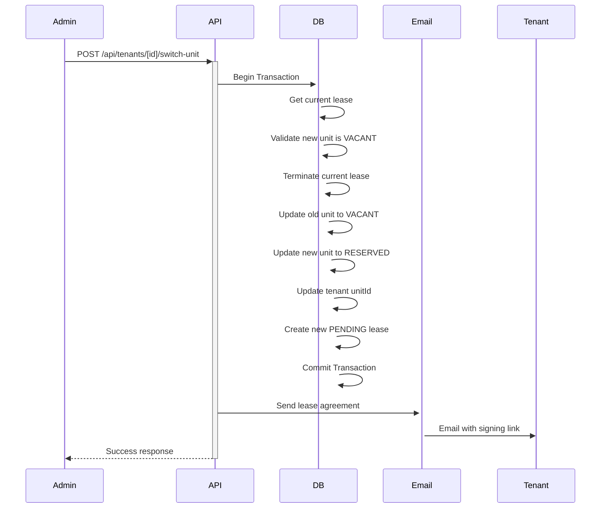
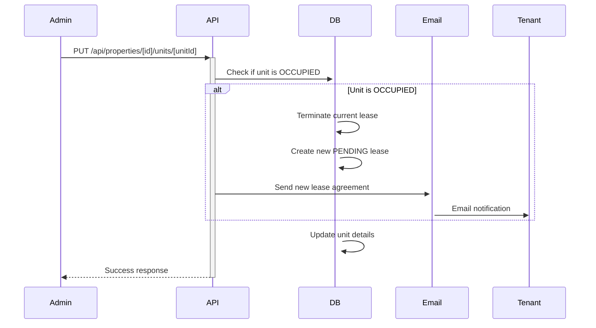

# 📡 MAKEJA HOMES - API DOCUMENTATION

**Version:** 1.0 (Phase 101)  
**Base URL:** `http://localhost:3000` (Development)

---

## 🔐 Authentication

All API routes (except auth endpoints) require JWT authentication.

**Headers:**
```
Authorization: Bearer <jwt_token>
```

**Roles:**
- `ADMIN` - Full system access
- `MANAGER` - Limited admin access
- `TENANT` - Tenant portal access

---

## 📋 API Endpoints

### Authentication (`/api/auth`)

#### POST `/api/auth/login`
Login user and get JWT token.

**Request:**
```json
{
  "email": "admin@makejahomes.com",
  "password": "password123"
}
```

**Response:**
```json
{
  "user": {
    "id": "user_xxx",
    "email": "admin@makejahomes.com",
    "role": "ADMIN"
  },
  "token": "jwt_token_here"
}
```

#### POST `/api/auth/logout`
Logout current user.

---

### Properties (`/api/properties`)

#### GET `/api/properties`
Get all properties.

**Query Params:**
- `status` - Filter by status

**Response:**
```json
{
  "properties": [
    {
      "id": "prop_xxx",
      "name": "Eagle Heights Zone",
      "location": "Ruiru",
      "type": "RESIDENTIAL",
      "totalUnits": 24,
      "occupiedUnits": 20
    }
  ]
}
```

#### POST `/api/properties`
Create new property.

**Request:**
```json
{
  "name": "Property Name",
  "location": "Location",
  "type": "RESIDENTIAL",
  "description": "Description"
}
```

#### GET `/api/properties/[id]`
Get single property with units.

#### PUT `/api/properties/[id]`
Update property.

#### DELETE `/api/properties/[id]`
Delete property (soft delete).

---

### Units (`/api/units`)

#### GET `/api/units`
Get all units.

**Query Params:**
- `status` - VACANT, OCCUPIED, RESERVED, MAINTENANCE
- `propertyId` - Filter by property

**Response:**
```json
{
  "units": [
    {
      "id": "unit_xxx",
      "unitNumber": "1A",
      "status": "OCCUPIED",
      "rentAmount": 30000,
      "depositAmount": 30000,
      "properties": {
        "id": "prop_xxx",
        "name": "Eagle Heights Zone"
      }
    }
  ],
  "total": 171
}
```

#### POST `/api/properties/[id]/units`
Create unit in property.

#### PUT `/api/properties/[id]/units/[unitId]`
Update unit (handles occupied unit workflow).

**Request:**
```json
{
  "unitNumber": "1A",
  "rentAmount": 35000,
  "depositAmount": 35000,
  "status": "OCCUPIED"
}
```

**Auto-triggers for occupied units:**
- Terminates current lease
- Creates new pending lease
- Sends email to tenant

---

### Tenants (`/api/tenants`)

#### GET `/api/tenants`
Get all tenants.

**Query Params:**
- `status` - Filter by lease status
- `propertyId` - Filter by property

#### POST `/api/tenants`
Create new tenant.

**Request:**
```json
{
  "firstName": "John",
  "lastName": "Doe",
  "email": "john@example.com",
  "phoneNumber": "+254712345678",
  "unitId": "unit_xxx",
  "startDate": "2026-01-01",
  "endDate": "2027-01-01",
  "rentAmount": 30000,
  "depositAmount": 30000
}
```

**Auto-creates:**
- User account
- Tenant profile
- Pending lease
- Sends welcome email

#### GET `/api/tenants/[id]`
Get tenant details with lease and payment history.

#### PUT `/api/tenants/[id]`
Update tenant information.

#### POST `/api/tenants/[id]/switch-unit` ⭐ NEW
Switch tenant to different unit.

**Request:**
```json
{
  "newUnitId": "unit_xxx",
  "keepDeposit": true
}
```

**Workflow:**
1. Validates new unit is vacant
2. Terminates current lease
3. Updates old unit to VACANT
4. Updates new unit to RESERVED
5. Creates new PENDING lease
6. Sends email with new lease agreement
7. All in transaction (rollback on failure)

---

### Leases (`/api/leases`)

#### GET `/api/leases`
Get all lease agreements.

**Query Params:**
- `status` - ACTIVE, PENDING, EXPIRED, TERMINATED
- `propertyId` - Filter by property

#### POST `/api/leases`
Create new lease.

#### PUT `/api/leases/[id]`
Update lease terms.

#### POST `/api/leases/[id]/terminate`
Terminate lease.

**Workflow:**
- Sets status to TERMINATED
- Updates `updatedAt` (used as termination date)
- Frees up unit

#### POST `/api/leases/[id]/renew`
Create renewal lease.

#### POST `/api/leases/[id]/send-contract`
Send lease agreement email.

---

### Payments (`/api/payments`)

#### GET `/api/payments`
Get all payments.

**Query Params:**
- `status` - PENDING, COMPLETED, FAILED
- `tenantId` - Filter by tenant

#### POST `/api/payments`
Record manual payment.

**Request:**
```json
{
  "tenantId": "tenant_xxx",
  "amount": 30000,
  "paymentMethod": "MPESA",
  "paymentDate": "2026-01-15",
  "referenceNumber": "ABC123"
}
```

#### POST `/api/payments/[id]/verify`
Verify and complete payment.

---

### Paystack (`/api/paystack`)

#### POST `/api/paystack/initialize`
Initialize payment with Paystack.

**Request:**
```json
{
  "email": "tenant@example.com",
  "amount": 30000,
  "tenantId": "tenant_xxx"
}
```

**Response:**
```json
{
  "authorization_url": "https://checkout.paystack.com/xxx",
  "reference": "ref_xxx"
}
```

#### GET `/api/paystack/verify/[reference]`
Verify Paystack payment.

---

### Dashboard (`/api/dashboard`)

#### GET `/api/dashboard/stats`
Get dashboard statistics.

**Response:**
```json
{
  "properties": 8,
  "units": 171,
  "tenants": 150,
  "occupancyRate": 87.7,
  "monthlyRevenue": 1200000,
  "activeLeases": 150,
  "expiringLeases": 12
}
```

#### GET `/api/dashboard/expiring-leases` ⭐ NEW
Get leases expiring soon.

**Query Params:**
- `days` - 30, 60, or 90 (default: 90)

**Response:**
```json
{
  "leases": [
    {
      "id": "lease_xxx",
      "tenant": {
        "name": "John Doe",
        "email": "john@example.com"
      },
      "unit": {
        "unitNumber": "1A",
        "property": "Eagle Heights"
      },
      "endDate": "2026-03-15",
      "daysRemaining": 45
    }
  ],
  "total": 12
}
```

---

### Cron Jobs (`/api/cron`)

#### GET `/api/cron/daily-tasks` ⭐ NEW
Execute daily automated tasks.

**Runs:**
- Sends expiring lease reminders
- Checks lease expiration
- Updates expired leases
- Sends renewal reminders

**Scheduled:** Daily at midnight (configure in hosting)

---

## 🔄 Workflows

### Unit Switch Workflow


### Occupied Unit Edit Workflow


---

## 📧 Email Templates

### Lease Agreement Email
- Subject: "🏠 New Lease Agreement - Sign Required"
- Contains: Lease terms, signing link
- Trigger: Lease creation, unit switch, occupied edit

### Payment Confirmation
- Subject: "✅ Payment Received - KSH [amount]"
- Contains: Payment details, receipt
- Trigger: Payment verification

### Lease Expiry Reminder
- Subject: "⏰ Lease Expiring Soon - Action Required"
- Contains: Expiry date, renewal options
- Trigger: Cron job (30/60/90 days before expiry)

---

## ⚡ Rate Limiting

Currently not implemented. Recommended for production:
- 100 requests per minute per IP
- 1000 requests per hour per user

---

## 🐛 Error Responses

All errors follow this format:
```json
{
  "error": "Error message",
  "code": "ERROR_CODE",
  "details": {}
}
```

**Common Error Codes:**
- `UNAUTHORIZED` - 401
- `FORBIDDEN` - 403
- `NOT_FOUND` - 404
- `VALIDATION_ERROR` - 400
- `SERVER_ERROR` - 500

---

## 🧪 Testing

Use tools like:
- **Postman** - API testing
- **Thunder Client** (VS Code) - Quick tests
- **curl** - Command line

**Example curl:**
```bash
curl -X GET http://localhost:3000/api/properties \
  -H "Authorization: Bearer YOUR_TOKEN"
```

---

## 📚 Additional Resources

- [Next.js API Routes](https://nextjs.org/docs/app/building-your-application/routing/route-handlers)
- [Prisma Docs](https://www.prisma.io/docs)
- [Paystack API](https://paystack.com/docs/api)

---

**Last Updated:** January 21, 2026  
**Maintainer:** Makeja Homes Development Team
