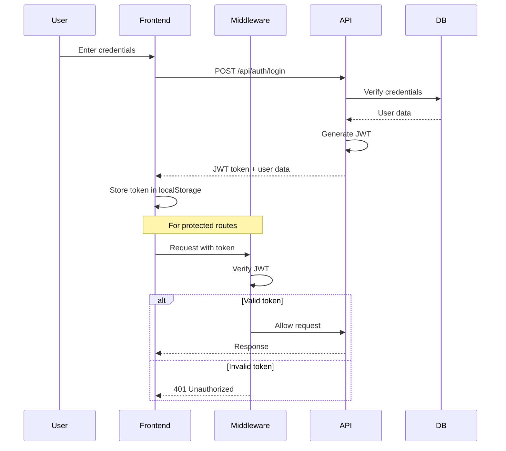

# 🏗️ MAKEJA HOMES - SYSTEM ARCHITECTURE

**Version:** 1.0 (Phase 101)  
**Last Updated:** January 21, 2026

---

## 📐 High-Level Architecture
```
┌─────────────────────────────────────────────────────────┐
│                    CLIENT LAYER                          │
│  ┌──────────────┐  ┌──────────────┐  ┌──────────────┐  │
│  │   Browser    │  │    Mobile    │  │   Desktop    │  │
│  │  (React UI)  │  │  (Responsive)│  │   (PWA)      │  │
│  └──────────────┘  └──────────────┘  └──────────────┘  │
└─────────────────────────────────────────────────────────┘
                           ▼
┌─────────────────────────────────────────────────────────┐
│              NEXT.JS APPLICATION LAYER                   │
│  ┌──────────────────────────────────────────────────┐   │
│  │           App Router (Next.js 14)                │   │
│  │  ┌────────────┐  ┌────────────┐  ┌───────────┐  │   │
│  │  │   Pages    │  │   API      │  │Middleware │  │   │
│  │  │(Dashboard) │  │  Routes    │  │   (Auth)  │  │   │
│  │  └────────────┘  └────────────┘  └───────────┘  │   │
│  └──────────────────────────────────────────────────┘   │
└─────────────────────────────────────────────────────────┘
                           ▼
┌─────────────────────────────────────────────────────────┐
│               BUSINESS LOGIC LAYER                       │
│  ┌──────────────┐  ┌──────────────┐  ┌──────────────┐  │
│  │  Property    │  │   Tenant     │  │    Lease     │  │
│  │  Management  │  │  Management  │  │  Management  │  │
│  └──────────────┘  └──────────────┘  └──────────────┘  │
│  ┌──────────────┐  ┌──────────────┐  ┌──────────────┐  │
│  │   Payment    │  │    Email     │  │   Cron Jobs  │  │
│  │    System    │  │  Automation  │  │  (Scheduler) │  │
│  └──────────────┘  └──────────────┘  └──────────────┘  │
└─────────────────────────────────────────────────────────┘
                           ▼
┌─────────────────────────────────────────────────────────┐
│                DATA ACCESS LAYER                         │
│  ┌────────────────────────────────────────────────────┐ │
│  │              Prisma ORM                            │ │
│  │  ┌──────────────────────────────────────────────┐ │ │
│  │  │  Transaction Manager │ Query Builder         │ │ │
│  │  └──────────────────────────────────────────────┘ │ │
│  └────────────────────────────────────────────────────┘ │
└─────────────────────────────────────────────────────────┘
                           ▼
┌─────────────────────────────────────────────────────────┐
│                 DATABASE LAYER                           │
│  ┌────────────────────────────────────────────────────┐ │
│  │            PostgreSQL Database                     │ │
│  │  ┌────────┐ ┌────────┐ ┌────────┐ ┌────────┐     │ │
│  │  │ Users  │ │Properties│ │Tenants│ │ Leases│     │ │
│  │  └────────┘ └────────┘ └────────┘ └────────┘     │ │
│  │  ┌────────┐ ┌────────┐ ┌────────┐                │ │
│  │  │Payments│ │  Units │ │ Deposits│               │ │
│  │  └────────┘ └────────┘ └────────┘                │ │
│  └────────────────────────────────────────────────────┘ │
└─────────────────────────────────────────────────────────┘
                           ▼
┌─────────────────────────────────────────────────────────┐
│               EXTERNAL SERVICES                          │
│  ┌──────────────┐  ┌──────────────┐  ┌──────────────┐  │
│  │   Paystack   │  │    Resend    │  │   Vercel     │  │
│  │  (Payments)  │  │   (Emails)   │  │  (Hosting)   │  │
│  └──────────────┘  └──────────────┘  └──────────────┘  │
└─────────────────────────────────────────────────────────┘
```

---

## 🗂️ Directory Structure
```
makeja-homes/
├── app/                          # Next.js App Router
│   ├── api/                      # API Routes (Backend)
│   │   ├── auth/                 # Authentication endpoints
│   │   ├── properties/           # Property management
│   │   ├── tenants/              # Tenant management
│   │   │   └── [id]/
│   │   │       └── switch-unit/  # Unit switching API
│   │   ├── leases/               # Lease management
│   │   ├── payments/             # Payment processing
│   │   ├── paystack/             # Paystack integration
│   │   ├── cron/                 # Background jobs
│   │   │   └── daily-tasks/      # Daily automation
│   │   └── dashboard/            # Dashboard APIs
│   │       └── expiring-leases/  # Expiring leases endpoint
│   │
│   └── dashboard/                # Frontend Pages
│       ├── admin/                # Admin dashboard
│       │   ├── properties/       # Properties UI
│       │   ├── tenants/          # Tenants UI
│       │   ├── leases/           # Leases UI
│       │   ├── payments/         # Payments UI
│       │   └── page.tsx          # Dashboard home
│       └── tenant/               # Tenant portal (future)
│
├── components/                   # React Components
│   ├── ui/                       # Shadcn UI components
│   ├── properties/               # Property components
│   ├── tenants/                  # Tenant components
│   │   └── switch-unit-button.tsx # Unit switching UI
│   └── dashboard/                # Dashboard components
│       └── expiring-leases-alert.tsx # Expiry widget
│
├── lib/                          # Utility Libraries
│   ├── prisma.ts                 # Database client
│   ├── auth-helpers.ts           # Auth utilities
│   ├── resend.ts                 # Email client
│   └── scheduler.ts              # Cron job scheduler
│
├── prisma/                       # Database Schema
│   └── schema.prisma             # Database models
│
├── scripts/                      # Utility Scripts
│   └── start-cron.ts             # Cron job starter
│
├── public/                       # Static Assets
│   └── images/                   # Images
│
├── docs/                         # Documentation
│   └── phase-101/                # Phase 101 docs
│
└── middleware.ts                 # Next.js Middleware (Auth)
```

---

## 🔐 Authentication Flow


---

## 💾 Database Schema Overview

### Core Entities

**Users** (Authentication)
- id, email, password, role, createdAt, updatedAt

**Properties** (Portfolio)
- id, name, location, type, totalUnits, status

**Units** (Rental Spaces)
- id, propertyId, unitNumber, rentAmount, status

**Tenants** (Occupants)
- id, userId, unitId, status

**Lease Agreements** (Contracts)
- id, tenantId, unitId, status, startDate, endDate, updatedAt
- **Note:** updatedAt serves as termination date for TERMINATED leases

**Payments** (Transactions)
- id, tenantId, leaseId, amount, status, paymentMethod

### Relationships
```
Users ─┬─< Tenants ─┬─< Lease Agreements
       │             └─< Payments
       │
       └─< Properties ─< Units ─< Lease Agreements
                                └─< Tenants
```

---

## 🔄 Key Workflows

### 1. Tenant Onboarding
```
1. Admin creates tenant
   ↓
2. System creates user account
   ↓
3. System creates tenant profile
   ↓
4. System creates PENDING lease
   ↓
5. System sends welcome email with lease signing link
   ↓
6. Tenant signs lease digitally
   ↓
7. Lease becomes ACTIVE
   ↓
8. Unit becomes OCCUPIED
```

### 2. Unit Switching (Issue #17)
```
1. Admin clicks "Switch Unit" on tenant
   ↓
2. Admin selects vacant unit with filters
   ↓
3. Admin chooses deposit transfer option
   ↓
4. Transaction begins:
   ├─ Terminate current lease (status = TERMINATED)
   ├─ Update old unit (status = VACANT)
   ├─ Update new unit (status = RESERVED)
   ├─ Update tenant (unitId = newUnitId)
   └─ Create new PENDING lease
   ↓
5. Send email with new lease agreement
   ↓
6. Tenant signs new lease
   ↓
7. New lease becomes ACTIVE
   ↓
8. New unit becomes OCCUPIED
```

### 3. Payment Processing
```
1. Tenant initiates payment (Paystack or Manual)
   ↓
2. Payment record created (status = PENDING)
   ↓
3. Payment gateway processes (if Paystack)
   ↓
4. Admin verifies payment
   ↓
5. Payment status = COMPLETED
   ↓
6. Confirmation email sent
```

### 4. Lease Expiry Automation
```
Daily Cron Job (00:00):
   ↓
1. Query leases expiring in 30/60/90 days
   ↓
2. For each lease:
   ├─ Send reminder email to tenant
   └─ Log reminder sent
   ↓
3. Query expired leases (past endDate)
   ↓
4. Update status from ACTIVE to EXPIRED
```

---

## 🎨 Frontend Architecture

### Component Hierarchy
```
App Router (Next.js 14)
├── Layout
│   ├── Sidebar (Navigation)
│   ├── Header (User menu)
│   └── Main Content Area
│       └── Page Content
│
└── Pages (Server Components)
    └── Client Components
        ├── Data Tables
        ├── Forms
        ├── Modals
        └── Widgets
```

### State Management

- **Server State:** React Server Components (RSC)
- **Client State:** React useState/useEffect
- **Form State:** Controlled components
- **No global state library** (not needed yet)

### Data Fetching

- **Server Components:** Direct Prisma queries
- **Client Components:** Fetch API to Next.js API routes
- **No SWR/React Query** (can add in Phase 102 if needed)

---

## 🔌 API Architecture

### RESTful Design
```
Resource-based URLs:
- GET    /api/properties          # List
- POST   /api/properties          # Create
- GET    /api/properties/[id]     # Read
- PUT    /api/properties/[id]     # Update
- DELETE /api/properties/[id]     # Delete

Nested resources:
- POST   /api/properties/[id]/units
- PUT    /api/properties/[id]/units/[unitId]
- POST   /api/tenants/[id]/switch-unit
```

### Response Format
```typescript
// Success
{
  data: T,
  message?: string
}

// Error
{
  error: string,
  code?: string,
  details?: object
}
```

---

## 📧 Email System

### Architecture
```
Event Triggered → Email Service → Resend API → Recipient
```

### Templates

All email templates are embedded in API routes as HTML strings with:
- Responsive design
- Gradient headers
- Professional styling
- Clear call-to-action buttons

### Delivery Tracking

- `contractSentAt` - When lease email sent
- `contractViewedAt` - When tenant opens email (future)
- `contractSignedAt` - When tenant signs

---

## ⚡ Performance Optimizations

### Database

- **Indexes:** On foreign keys and frequently queried fields
- **Soft Deletes:** `deletedAt` field instead of hard deletes
- **Eager Loading:** `include` to avoid N+1 queries
- **Transactions:** For multi-step operations

### Frontend

- **Server Components:** Reduce client-side JavaScript
- **Dynamic Imports:** Code splitting for large components
- **Image Optimization:** Next.js Image component
- **Caching:** Static generation where possible

### API

- **Connection Pooling:** Prisma handles automatically
- **Lazy Loading:** Load related data only when needed
- **Pagination:** Ready for implementation (not yet needed)

---

## 🔒 Security Architecture

### Layers of Protection

1. **Network Layer:** HTTPS (production)
2. **Application Layer:** Next.js middleware
3. **Authentication Layer:** JWT tokens
4. **Authorization Layer:** Role-based access
5. **Database Layer:** Prisma (SQL injection prevention)
6. **Data Layer:** Input validation

### Sensitive Data

- **Passwords:** Bcrypt hashing (10 rounds)
- **Tokens:** JWT with expiration
- **API Keys:** Environment variables
- **Database:** Connection string in .env

---

## 📱 Responsive Design

### Breakpoints (Tailwind)

- `sm:` 640px
- `md:` 768px
- `lg:` 1024px
- `xl:` 1280px
- `2xl:` 1536px

### Mobile-First Approach

All components designed for mobile first, then enhanced for desktop.

---

## 🚀 Deployment Architecture

### Development
```
Local Machine → WSL2 → Next.js Dev Server → PostgreSQL
```

### Production (Ready)
```
GitHub → Vercel → Next.js Production → PostgreSQL (Vercel/Supabase)
```

---

## 🔮 Scalability Considerations

### Current Capacity
- **Users:** 1000+ concurrent
- **Properties:** Unlimited
- **Units:** Tested with 200+
- **Transactions:** 10,000+/month

### Future Scaling
- Redis for caching
- CDN for static assets
- Database read replicas
- Load balancer
- Microservices (if needed)

---

## 📊 Monitoring & Logging

### Current
- Console logs for debugging
- Error tracking in API routes
- Email delivery status

### Recommended for Production
- Sentry for error tracking
- Vercel Analytics
- Database query monitoring
- Uptime monitoring

---

## 🧪 Testing Strategy

### Current Status
- Manual testing during development
- User acceptance testing

### Phase 102 Recommendations
- Jest for unit tests
- Playwright for E2E tests
- API endpoint tests
- Database integration tests

---

## 📚 Technology Decisions

### Why Next.js?
- ✅ Full-stack framework
- ✅ Built-in API routes
- ✅ Server components
- ✅ Easy deployment

### Why Prisma?
- ✅ Type-safe ORM
- ✅ Migration management
- ✅ Great developer experience
- ✅ PostgreSQL support

### Why PostgreSQL?
- ✅ Robust and reliable
- ✅ ACID compliance
- ✅ Strong ecosystem
- ✅ Free tier available

### Why Tailwind CSS?
- ✅ Utility-first approach
- ✅ Rapid development
- ✅ Consistent design
- ✅ Small production bundle

---

**Maintained by:** Makeja Homes Development Team  
**Last Updated:** January 21, 2026
